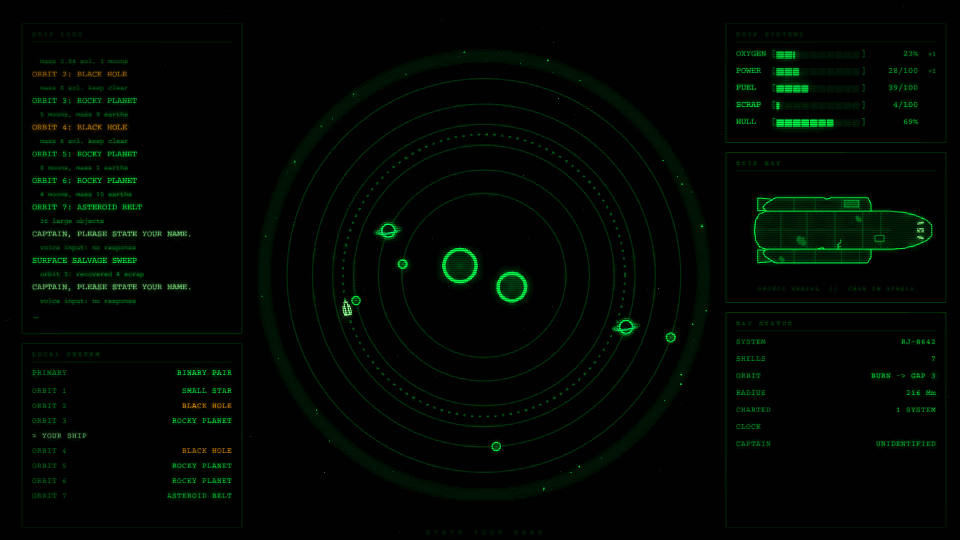
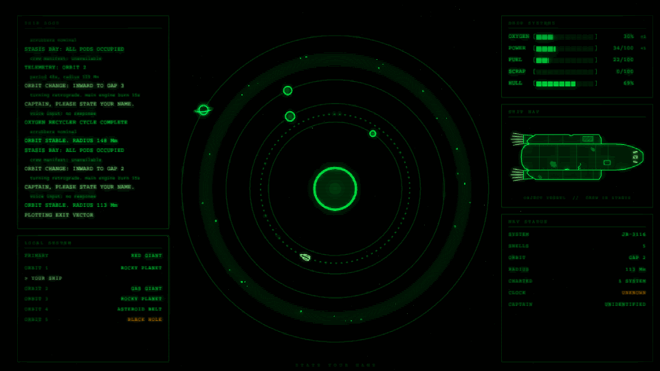

# State Your Name: Screensaver

A Windows screensaver set in the world of **State Your Name**, a space-exploration idle game. Your ship's computer boots in emergency mode, sweeps a procedurally generated star system, and cruises it: changing orbits, mining asteroid belts, and asking you to state your name. Then it jumps to the next system. It runs forever, and no two systems are the same.



## Install

1. Download `StateYourName-screensaver.zip` from the [latest release](https://github.com/dalton-baker/state-your-name-screensaver/releases/latest), or from the newest [build run](https://github.com/dalton-baker/state-your-name-screensaver/actions/workflows/build.yml).
2. Unzip it, right-click **StateYourName.scr**, and choose **Install**.

Choose **Test** instead to try it without installing. Move the mouse or press any key to exit. The `.scr` is a single self-contained 13 MB file, so .NET doesn't need to be installed.

## What's on screen

- **Local system:** systems are generated with the same rules as the game. A single star, a binary pair, or a black hole sits at the center, with 4–7 orbital shells of rocky planets, ringed gas giants, smaller stars, black holes, and asteroid belts. Everything orbits at the game's speeds.
- **Your ship** holds its orbit in a gap between shells, pulses its thrusters, and occasionally burns to a neighboring gap. Inward burns turn retrograde first.
- **Ship logs, systems, nav, and status** panels in the game's green-phosphor terminal style.
- **The cycle:** boot, then sensor sweep, about 90 seconds of cruising, then an FTL jump with star streaks into a new system.
- **Screensaver details:** phosphor glow, scanlines, and a slow drift of the whole layout so nothing burns in.



## Building

Requires the .NET 8 SDK or newer.

It's a single MonoGame (OpenGL) project that runs on Windows, Linux, and macOS.

```sh
# Run it in a window while working on it
dotnet run --project src/Screensaver -- --windowed --size 1600x900

# Publish the screensaver: one self-contained, trimmed StateYourName.exe (~13 MB)
dotnet publish src/Screensaver -c Release -r win-x64 -o publish
# then rename publish/StateYourName.exe to StateYourName.scr
```

| Option | |
| --- | --- |
| `/s`, `/c`, `/p` | Windows screensaver arguments: run, settings (there are none), and preview (exits). No argument also runs it. |
| `--windowed`, `--size WxH` | Run in a window. Escape exits. |
| `--seed N` | Generate the same systems every time. |
| `--capture DIR --frames N --fps F --skip S` | Render frames to PNGs, starting S seconds in. This is how `docs/` was made. |

CI (`.github/workflows/build.yml`) builds the `.scr` on every push. Pushing a `v*` tag attaches the zip to a GitHub release.

### Layout

```
src/Screensaver/      the project: StateYourName.csproj, app manifest, icon, font
  World/              star system generation, orbits, the system view renderer, starfield
  Hud/                terminal panels: logs, ship systems, readouts, boot screen
  Rendering/          vector primitives, text, palette
  Director.cs         boot, scan, cruise, and jump cycle
  ScreensaverGame.cs  render pipeline (glow, scanlines) and screensaver input rules
tools/make-icon.py    generates the app icon
```

## Credits

- Started from Cam Abreu's [MonogameScreenSaver](https://github.com/JamCamAbreu/MonogameScreenSaver) template (GPL-3.0). It's updated here to MonoGame 3.8.5 and .NET 8, moved to the cross-platform OpenGL backend (DirectX needs Windows Forms, which can't be trimmed), and the content pipeline is dropped in favor of runtime font rendering.
- [MonoGame](https://monogame.net) (Ms-PL) and [FontStashSharp](https://github.com/FontStashSharp/FontStashSharp) (zlib).
- Text uses Windows' Courier New when available, the game's own font. Otherwise it uses the bundled [Courier Prime](https://github.com/quoteunquoteapps/CourierPrime) (SIL OFL 1.1, see `src/Screensaver/Fonts/OFL.txt`).

## License

GPL-3.0, inherited from the template. See [LICENSE](LICENSE).
